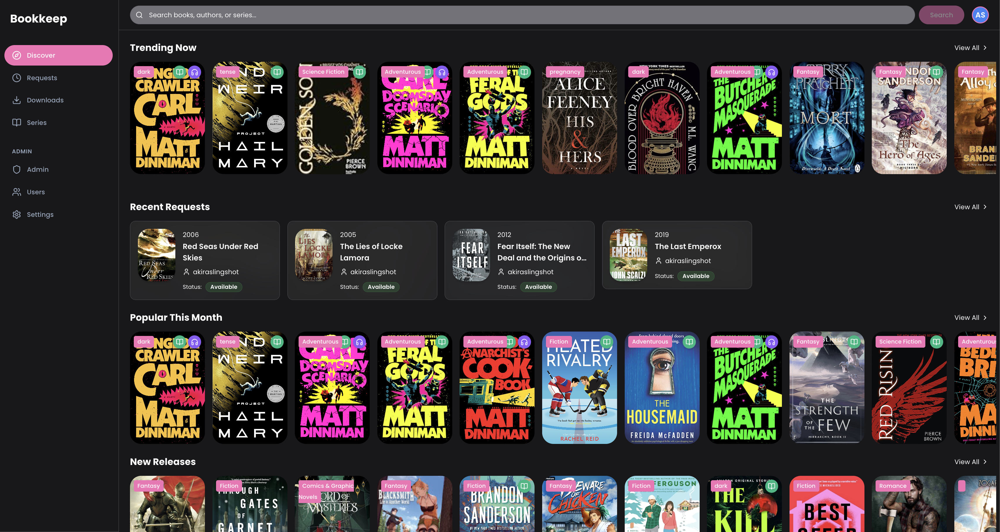
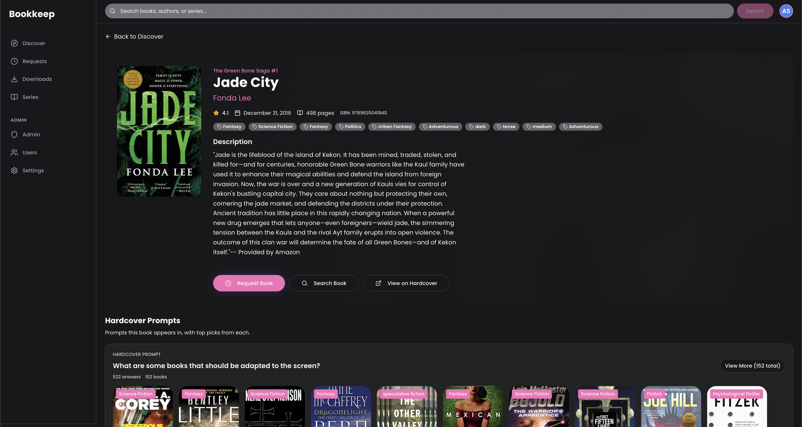
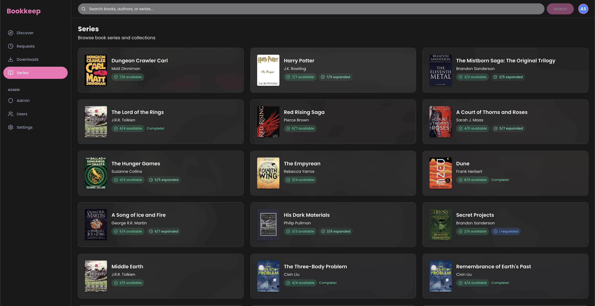
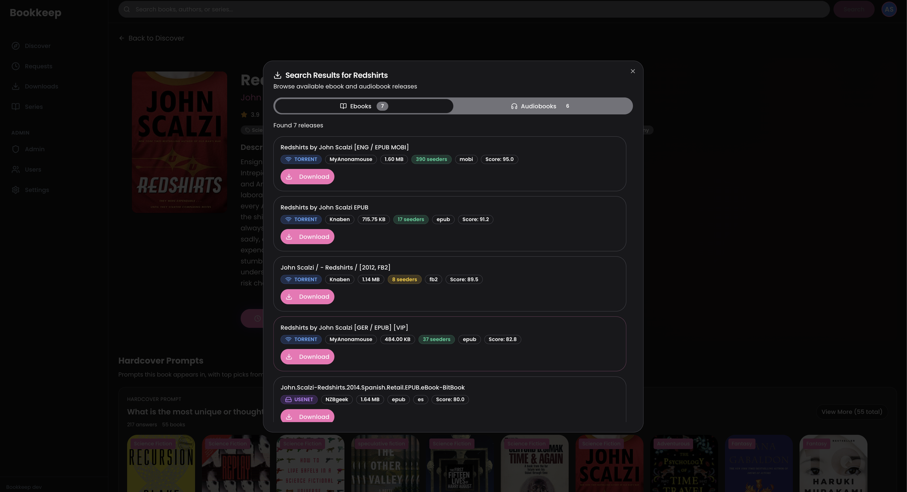
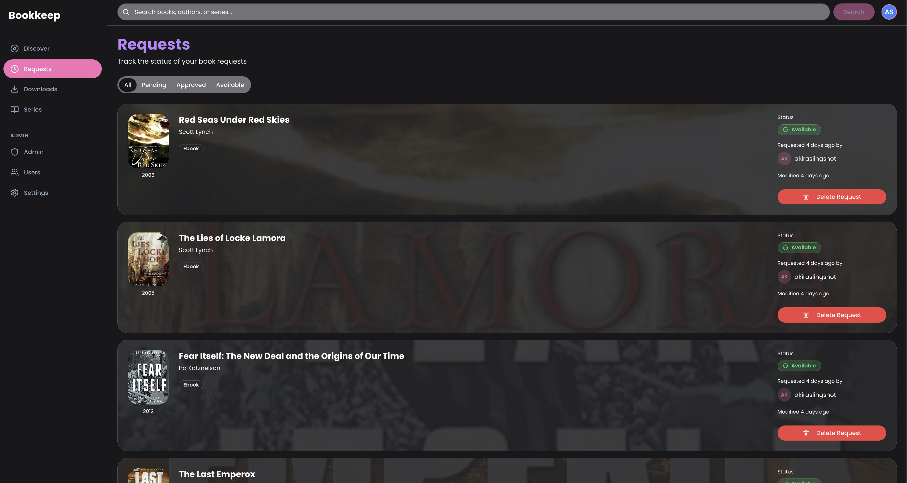

# Bookkeep

Bookkeep is a self-hosted library companion for discovering books, exploring series, and requesting formats through integrated services.

## Features

- Discover trending and popular titles
- Search books, authors, and series
- Author detail pages with bio, portrait, books, and series
- Book and series request flows
- Admin tooling for users, requests, and settings

## Screenshots

### Discover


### Book Details


### Series


### Search


### Requests


## Tech Stack

- React + Vite + TypeScript
- Tailwind CSS + shadcn/ui
- FastAPI backend
- PostgreSQL database
- Optional Redis cache

## Requirements

- Docker + Docker Compose
- Hardcover API token (from https://hardcover.app)

## Running with Docker Compose (from source)

The default `docker-compose.yml` builds from source and runs the app with Postgres + Redis.

```sh
export HARDCOVER_API_TOKEN=your_token_here
docker-compose up --build
```

Access:
- App (frontend + API): http://localhost:8000
- API docs: http://localhost:8000/docs

## Running with Docker Compose (Docker Hub image)

Create a separate compose file (e.g. `docker-compose.dockerhub.yml`) with a prebuilt image:

```yaml
version: '3.8'

services:
  app:
    image: akiraslingshot/bookkeep:latest
    container_name: bookkeep
    environment:
      DATABASE_URL: postgresql://bookkeep:bookkeep_password@db:5432/bookkeep_db
      HARDCOVER_API_TOKEN: ${HARDCOVER_API_TOKEN:-}
      REDIS_URL: redis://redis:6379/0
    ports:
      - "8000:8000"
    depends_on:
      - db
      - redis
    restart: unless-stopped

  db:
    image: postgres:16-alpine
    container_name: bookkeep-db
    environment:
      POSTGRES_DB: bookkeep_db
      POSTGRES_USER: bookkeep
      POSTGRES_PASSWORD: bookkeep_password
    ports:
      - "5432:5432"
    volumes:
      - postgres_data:/var/lib/postgresql/data
    restart: unless-stopped

  redis:
    image: redis:7-alpine
    container_name: bookkeep-redis
    ports:
      - "6379:6379"
    volumes:
      - redis_data:/data
    restart: unless-stopped

volumes:
  postgres_data:
  redis_data:
```

Run it:

```sh
docker-compose -f docker-compose.dockerhub.yml up
```

## Configuration

Required environment variables:
- `HARDCOVER_API_TOKEN`
- `DATABASE_URL`

Optional:
- `REDIS_URL`
- `READARR_URL`
- `READARR_API_KEY`

## Readarr Integration

Bookkeep is a request tool: users request books (ebook/audiobook) in the UI, and those requests are sent to Readarr for fulfillment. Configure Readarr in Settings and ensure the backend can reach your Readarr instance.

Recommended flow:
- Set `HARDCOVER_API_TOKEN` and start Bookkeep.
- In Bookkeep settings, add your Readarr server (URL + API key).
- Users request books; Bookkeep forwards those requests to Readarr.

## Jobs & Scheduling

Bookkeep runs background jobs via APScheduler. You can view and change schedules in Settings → Jobs, and manually trigger a job without changing its schedule.

Default jobs:
- `refresh_seed_data` (daily): pulls fresh books from Hardcover to keep the local catalog populated.
- `check_processing_requests` (every 5 minutes): checks for request status changes and updates requests that have completed.
- `sync_from_booklore` (daily): syncs availability from Booklore, importing items and marking matching requests as available.
- `sync_missing_metadata` (every 6 hours): fills missing metadata (cover, rating, IDs, series) using Hardcover.

Notes:
- Job state (e.g., seed refresh offset) is stored in the database.
- If Redis is unavailable, jobs still run; caching falls back to memory.

## Search Performance Notes

Autocomplete uses cached/local data only. Full searches call the Hardcover search API and cache results for faster subsequent queries.

## Releases & Docker Hub

Images are published to Docker Hub on pushes to `main` and `develop` with multi-arch support (amd64 + arm64).

Required GitHub secrets:
- `DOCKERHUB_USERNAME`
- `DOCKERHUB_TOKEN`

Version bump labels for `develop` → `main` PRs:
- `bump:major`
- `bump:minor`
- `bump:patch`

Main branch publishes:
- `vX.Y.Z`
- `X.Y.Z`
- `latest`

Develop branch publishes:
- `vX.Y.Z-develop-<shortsha>`

## Caching

Redis is used to cache Hardcover API responses. If Redis is unavailable, the app falls back to in-memory caching.

See `backend/README.md` for backend API details.
